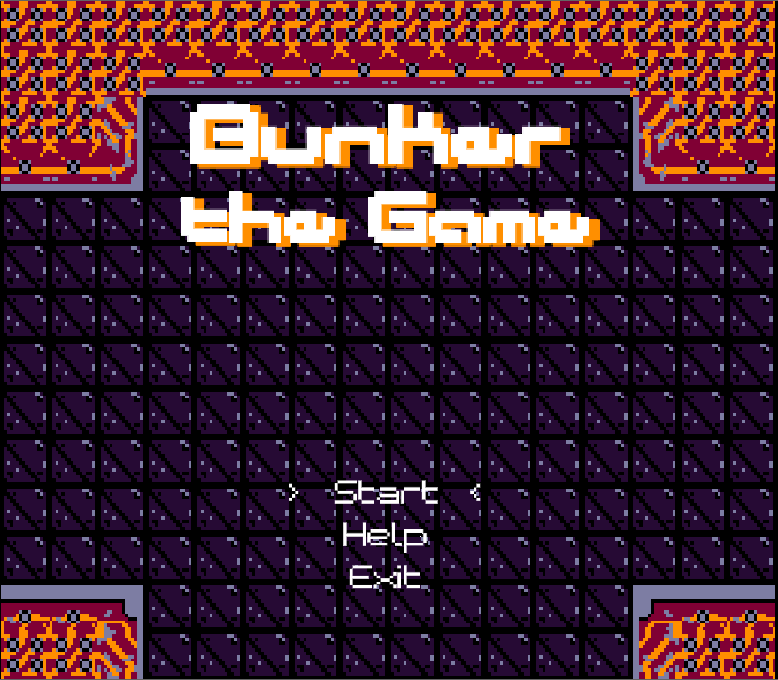

# Bunker The Game

<div align="center">
  
</div>

A simple fast paced action platformer created using GDScript for [Lospec 2 Game Jam](https://itch.io/jam/lospec-jam-2)
it's currently targeted for LS16 Home Console (Lospec 2 Console) with 256x224 Resolution,
strict color pallete, a limited sound channel, control and more.

## Features

As LS16 Home Console is a rather limited console, and limited time by us due to university assignment, the game currently contains following features :

- 2 types of enemies
- 1 Boss
- 4 Unique BGM
- A rudimentary score system
- 2 Pick up able item
- Perma death (Be careful)

And for mechanics, figure it out yourself:)

## Primary Controls

| In Game | Keyboard |        Action     |
|---------|----------|-------------------|
|    A    |     Z    | Primary Attack    |
|    B    |     X    | Secondary Attack  |
|  Start  |   Enter  | Accept & Pause    |
|  Select |   Space  | ???               |
|  D-Pads |   Arrow  | Navigation        |

* Secondary Controls : Figure it out yourself, why not try pressing `Select` :)

## Installation

Please wait until it's ready, week 4 of May 2024 will be first release

## Development

Make sure you have Godot 4.2.2 installed or atleast 4.1+

```sh
git clone https://github.com/UnknownRori/bunker-the-game
cd bunker-the-game

# Open with Godot
```

## License

This project [MIT](https://github.com/UnknownRori/bunker-the-game/blob/main/LICENSE) license
